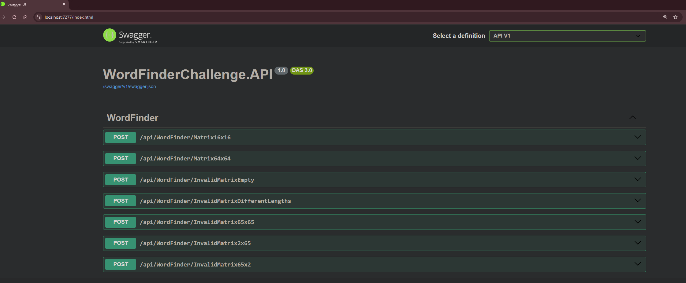
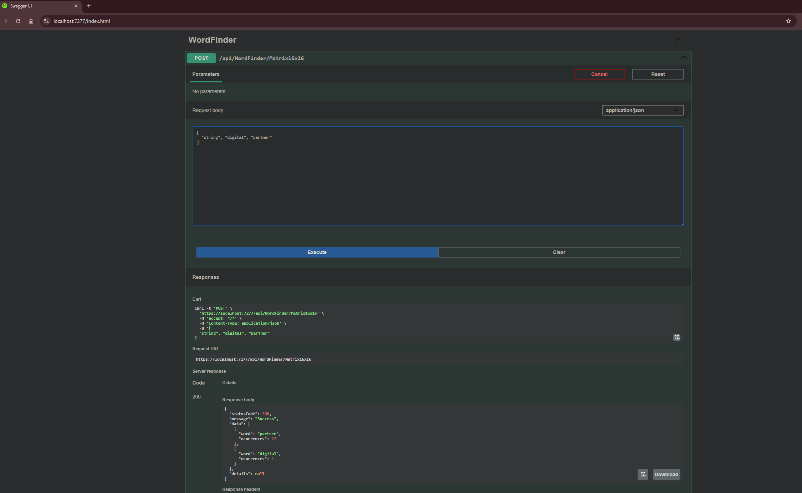
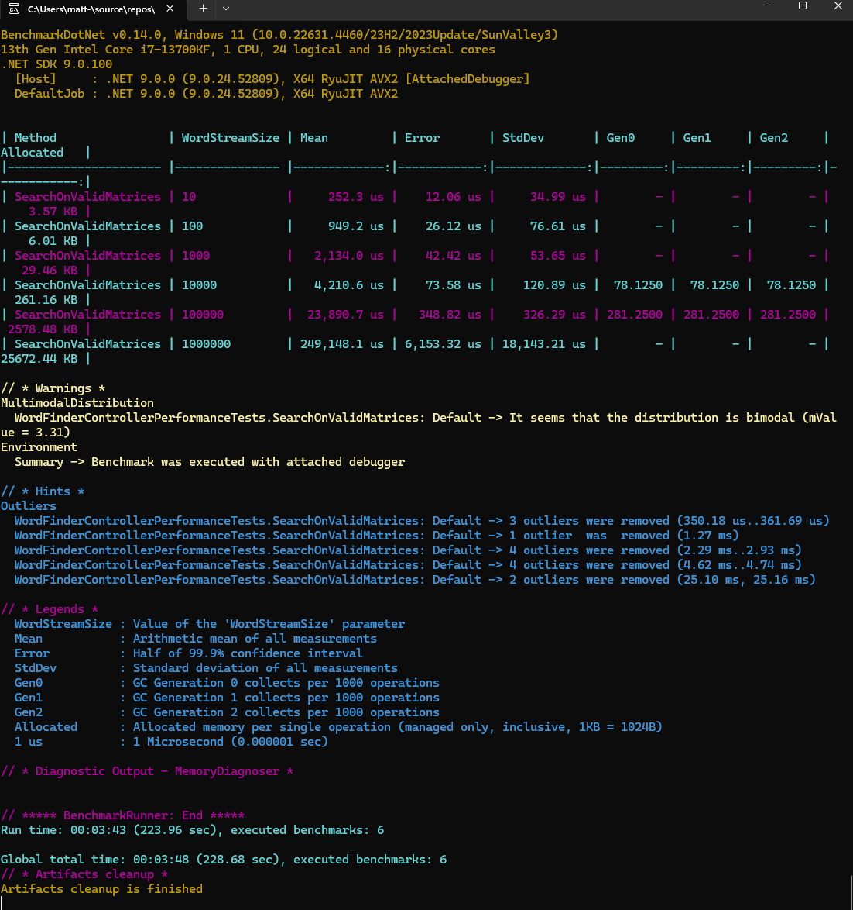
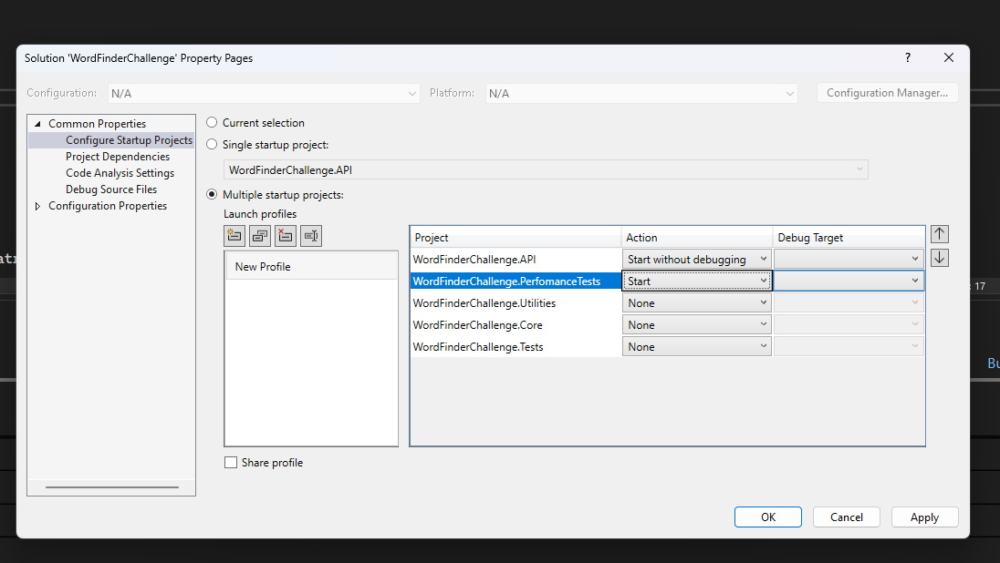
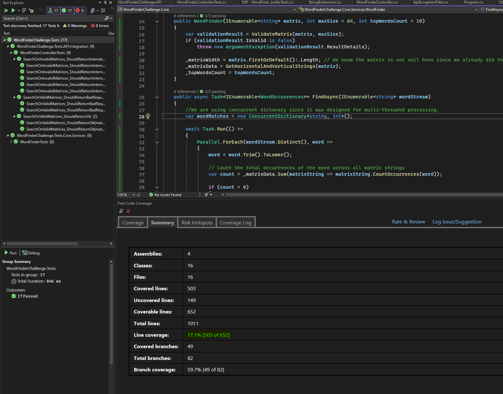
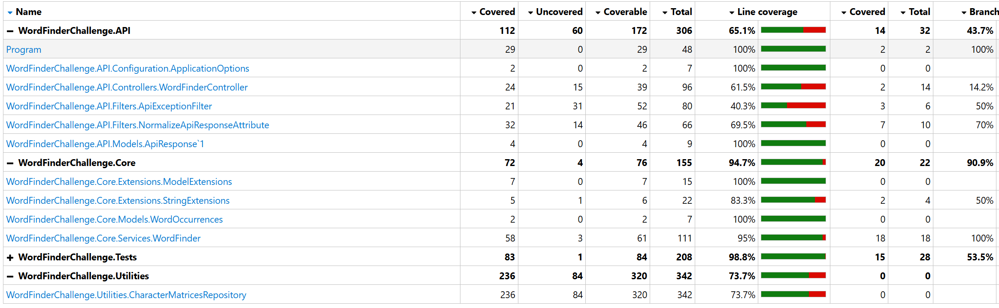

# **Welcome to the WordFinder Challenge - API**

## Tech Stack
- .NET 9 (C#)
- XUnit
- Bogus
- Fine Code Coverage (VS extensions for test line coverage scan)
- BenchmarkDotNet
- Swagger
- TestServer (for API integration testing)

### Challenge resolution approach

I have chosen to utilize threading and asynchronous methods for the lookup process, as I believe this approach optimally leverages system resources to achieve high responsiveness. It also ensures the application remains stable and avoids potential deadlock or unresponsiveness, especially given the unlimited size of word streams that can be included in a single request. I will share some promising benchmark results later in this document.
I have decided to develope an API solution to demonstrate my expertise and the best practices I use to create high-quality, maintainable, and easily understandable code.

### How to run the Application:

- Clone this repository
- Open Visual Studio
- Set "WordFinderChallenge.API" project as startup project
- Press "F5" or click or the "Play/https" button
- If asked, trust the certificates and proceed to the website
- You should now see this:

<br >



### **We are all set for the fun part!.**

We want to able to have Web API endpoints to start interacting with the app, that's why we have the WordFinderChallenge.API project and we have SwaggerUI configured so it's easier to interact with (of course that you can use Postman or any other client of your preference). 

You will get an API normalized response like below:

```
{
  "statusCode": 200,
  "message": "Success",
  "data": [
    {
      "word": "restaurant",
      "ocurrences": 6
    },
    {
      "word": "digital",
      "ocurrences": 5
    },
    {
      "word": "partner",
      "ocurrences": 2
    }
  ],
  "details": null
}
```
If you send an invalid request for example a wrong formated JSON <b>request</b>, like:
``` 
[
    "partner",
]
```
You will get the following <b>response:</b>
``` 
{
  "statusCode": 400,
  "message": "One or more validation errors occurred.",
  "data": null,
  "details": {
    "wordStream": [
      "The wordStream field is required."
    ],
    "$[1]": [
      "The JSON array contains a trailing comma at the end which is not supported in this mode. Change the reader options. Path: $[1] | LineNumber: 2 | BytePositionInLine: 0."
    ]
  }
}
```


<br >

You can now click on the desired endpoint, then on "Try it out" and set the parameters as you like, a valid request is an <b>array of strings</b>, click "Execute" and boom, you are interacting live with our API! This is what you will see:

<br >



### Here are some words placed in the matrices you can use to perform the search:
- <b>Horizontal words</b> : payments, partner, restaurant, commerce, high, low, awesome
- <b>Vertical words</b>: digital, eat

## Benchmark (performance) results

We see really good numbers as you can see below in the report:


### Here we can see more details about the performance test, like the system in which the test ran and the time it took to complete the process in millisecods and seconds:
```
BenchmarkDotNet v0.14.0
Windows 11 (10.0.22631.4460/23H2/2023Update/SunValley3)  
13th Gen Intel Core i7-13700KF, 1 CPU, 24 logical and 16 physical cores  
.NET SDK 9.0.100  
[Host] : .NET 9.0.0 (9.0.24.52809), X64 RyuJIT AVX2 [AttachedDebugger]  
DefaultJob : .NET 9.0.0 (9.0.24.52809), X64 RyuJIT AVX2  
```

| Method                | WordStreamSize | Mean (μs)   | Mean (ms) | Mean (s)   | Error       | StdDev      | Gen0      | Gen1      | Gen2      | Allocated   |
|-----------------------|----------------|-------------|-----------|------------|-------------|-------------|-----------|-----------|-----------|-------------|
| SearchOnValidMatrices | 10             | 252.3 μs    | 0.252 ms  | 0.000252 s | 12.06 μs    | 34.99 μs    | -         | -         | -         | 3.57 KB     |
| SearchOnValidMatrices | 100            | 949.2 μs    | 0.949 ms  | 0.000949 s | 26.12 μs    | 76.61 μs    | -         | -         | -         | 6.01 KB     |
| SearchOnValidMatrices | 1000           | 2,134.0 μs  | 2.134 ms  | 0.002134 s | 42.42 μs    | 53.65 μs    | -         | -         | -         | 29.46 KB    |
| SearchOnValidMatrices | 10000          | 4,210.6 μs  | 4.211 ms  | 0.004211 s | 73.58 μs    | 120.89 μs   | 78.1250   | 78.1250   | 78.1250   | 261.16 KB   |
| SearchOnValidMatrices | 100000         | 23,890.7 μs | 23.891 ms | 0.023891 s | 348.82 μs   | 326.29 μs   | 281.2500  | 281.2500  | 281.2500  | 2578.48 KB  |
| SearchOnValidMatrices | 1000000        | 249,148.1 μs| 249.148 ms| 0.249148 s | 6,153.32 μs | 18,143.21 μs| -         | -         | -         | 25672.44 KB |

If you are interested in running the benchmark tests yourself, you will need to setup 2 projects as StartUp projects, they are:

- <b>WordFinderChallenge.API</b>
- <b>WordFinderChallenge.PerfomanceTests</b>

In order to do this, go to Visual Studio and then right click into the solution, you will see an option called <b>"Configure startup projects"</b>, make sure you got it set up as this:



- Then just press F5 or click on ther Play button and see the magic happens!
- <b>NOTE</b>: Remember to set Visual Studio in Release Mode

## Test code covarage

We can see below the report we got from the Fine Code Coverage tool, and we can see we got more that 75% of coverage!



More detailed report:


And that's pretty much it, we can discuss it further for sure in a meeting, thank you for your time, and if you have any questions or concerns, please reach me out to me via email: **matiasromagnano@gmail.com**.